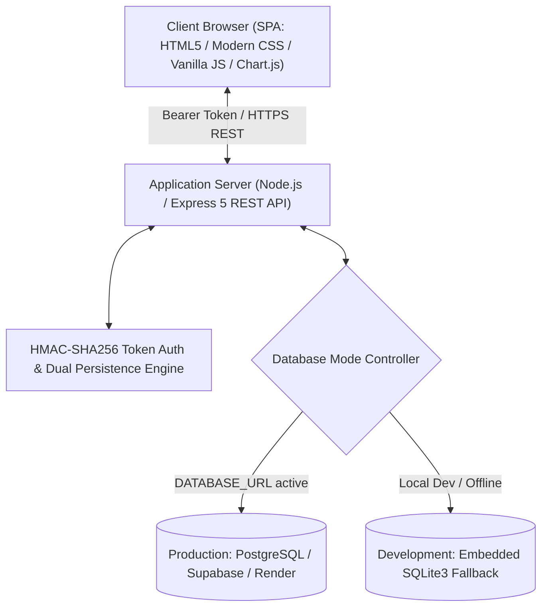
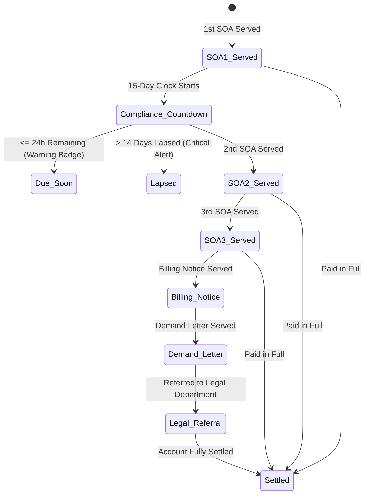

# CONCEPT PAPER
## Social Security System (SSS) Toledo City Branch
### Account Management System (AMS): Digital Operations, Delinquency Tracking, & Settlement Monitoring Platform

---

### Executive Summary

The **Social Security System (SSS) Toledo City Branch** oversees social security coverage, compliance, and contribution collection across a wide geographical jurisdiction in Western Cebu. The branch regularly deals with hundreds of delinquent, intermittent, and non-complying employers. Historically, managing the lifecycle of delinquency enforcement—including Statement of Account (SOA) service, 15-day compliance monitoring, billing notices, demand letters, and legal escalations—relied heavily on fragmented spreadsheets, manual physical ticket indexing, and decentralized officer records. This model created operational bottlenecks, compromised audit trails, and increased compliance lapse rates.

To address these systemic challenges, the **SSS Toledo Account Management System (AMS)** was engineered as an enterprise-grade, role-based operations dashboard and delinquency management portal. This document serves as the definitive **Concept Paper**, synthesizing the system's foundational rationale, operational workflows, dual-database architecture, and the complete chronology of revisions made throughout its continuous development lifecycle.

---

### 1. Project Background & Rationale

Under Republic Act No. 11199 (The Social Security Act of 2018), employers bear a statutory obligation to register employees, deduct monthly contributions, and remit them to the Social Security System within mandated deadlines. Delinquent accounts incur monthly compounding penalties and legal interest.

In the Toledo City Branch, three dedicated Account Officers (AOs) manage distinct municipal territories:
* **Account Officer 1 (AO1)**: Toledo City (Urban & Commercial Core)
* **Account Officer 2 (AO2)**: Municipalities of Balamban & Asturias
* **Account Officer 3 (AO3)**: Municipalities of Pinamungajan, Aloguinsan, & Tuburan

Supervised by the **Branch Administrator**, these officers must systematically enforce compliance through a multi-tiered legal notice escalation framework. However, manual workflows suffered from four critical vulnerabilities:
1. **Lapsed Compliance Timers**: Employers are granted a strict 15-day window from receipt of an SOA to settle or contest. Tracking these deadlines manually across hundreds of accounts led to unflagged lapses.
2. **Data Desynchronization & Accidental Deletion**: Decentralized records lacked row-level protections. Unintentional modifications or deletions of active delinquency records compromised branch collectible records.
3. **Audit Trail Deficits**: Lack of standardized recording for who physically received SOAs, demand letters, or billing notices created evidential hurdles when referring accounts to the SSS Legal Department.
4. **Disjointed Performance Analytics**: Consolidating monthly quota achievements (₱5,000,000 per AO / ₱15,000,000 branch quota) required hours of manual spreadsheet compilation at month-end.

---

### 2. System Architecture & Engineering Principles

#### 2.1 Technology Stack
* **Frontend**: Vanilla HTML5, CSS Custom Properties (modern glassmorphism, responsive grid), Vanilla JavaScript (ES6+), Chart.js data visualization.
* **Backend**: Node.js, Express.js 5 RESTful API routing.
* **Persistence Layer**: Native PostgreSQL (`pg`) with automatic, graceful fallback to local SQLite3 (`sqlite3`) for offline and zero-config local development.
* **Security Layer**: Stateless HMAC-SHA256 bearer tokens, dual client storage (`localStorage` + `sessionStorage`) with resilient page-refresh rehydration (`restoreSessionOnLoad()`), and SHA-256 cryptographic password hashing.

#### 2.2 Cloud Infrastructure Resilience & Deployment Case Study (Render PaaS & PostgreSQL Lifecycle)

During the cloud deployment lifecycle on Render (Singapore Region: Web Service `AMS` and PostgreSQL database `sss-toledo-db`), an infrastructure outage occurred that highlighted critical lessons in operational continuity:

* **Observed System Incident**:
  1. Database Service: `sss-toledo-db` marked as **`Suspended by Render`**.
  2. Web Application Service: `AMS` marked as **`Failed deploy`**.
  3. Diagnostic Stack Trace: `getaddrinfo ENOTFOUND dpg-da99t9e7bikc738o2iqg-a` followed by `version 'GLIBC_2.38' not found (required by node_sqlite3.node)`.

* **Root Cause Breakdown**:
  1. **Render 30-Day Free Tier Lifecycle**: Render free-tier PostgreSQL databases expire and suspend automatically after 30 days of operation. When suspended, Render disables container routing and purges the internal domain (`dpg-da99t9e7bikc738o2iqg-a`), causing instant DNS lookup failure (`ENOTFOUND`).
  2. **Uncontrolled Fallback to Incompatible Local Binaries**: Upon PostgreSQL connection failure, the legacy server script attempted an unshielded fallback to local `sqlite3`. Because modern `sqlite3@6.0.1` Linux prebuilts require `GLIBC_2.38`, while Render's Linux container image runs `GLIBC_2.35`, the application suffered a fatal process abort.

* **Implemented Architectural Remediations (Commit `b28ed48`)**:
  * **Defensive Driver Isolation**: Encapsulated `getSqliteDb()` in defensive error boundaries in [`api/db.js`](file:///c:/Users/louise%20margarette/OneDrive/Documents/AMS-main/api/db.js) so binary link failures do not abort deployment scripts without diagnostic guidance.
  * **Cloud Cold-Start Resilience**: Increased PostgreSQL connection and query timeouts from 3,000ms to 10,000ms (`connectionTimeoutMillis: 10000`) to survive free-tier instance spin-up latency.
  * **Database Sustainability Strategy**: Formulated clear recovery pathways: (a) re-provisioning fresh PostgreSQL instances within the matching regional cluster (Singapore) using External Connection URLs, or (b) migrating to permanent non-expiring PostgreSQL providers (e.g. Supabase or Neon.tech).

---

### 3. Core Functional Pillars

#### 3.1 Role-Based Access Control (RBAC) & Protective Oversight
The system implements strict role-based data partitioning:
* **Branch Administrator (`admin`)**: Branch-wide visibility across all AO portfolios and consolidated MasterFile. To prevent catastrophic data loss, the MasterFile features **Edit-Only Protection** (delete buttons and bulk purge operations are suppressed). When an Administrator edits an employer profile, basic demographic data (Business Name, Employer ID, Address) is permanently locked in read-only mode, restricting administrative modifications to financial figures, penalty recalculations, and payment postings.
* **Account Officers (`ao1`, `ao2`, `ao3`)**: Automatically scoped to their assigned geographic jurisdictions. Officers possess full CRUD capabilities over their assigned employers, with inline row actions restricted to prevent premature deletion of unsettled accounts.
* **Super Administrator (`superadmin`)**: System-level administrative oversight and diagnostic capabilities.

#### 3.2 15-Day Compliance Cycle & Intelligent Escalation

* **Dynamic Time Calculations**: The engine calculates compliance expiration from the exact date the latest SOA was served.
* **Proactive Notification Hub**: Accounts approaching deadline or exceeding the 15-day grace period trigger real-time badge counters in the sidebar navigation rail and pulse-highlighted table indicators.
* **1-Click Deep Inspection**: Clicking an alert in the Reminders Modal navigates directly to the employer record in the MasterFile, auto-scrolling and applying an animated highlight border.

#### 3.3 Strict Recipient Signature Auditing
To ensure evidentiary admissibility in case of legal referral, every milestone captures:
* Date Served
* **Exact Authorized Person / Signatory Received** (`person_received`, `soa2_person_received`, `soa3_person_received`, `billing_person_received`, `demand_person_received`)
* Legal department docketing metadata (Assigned Handling Lawyer, Docket Number, Legal Filing Date).

#### 3.4 Financial Engine & Branch Quotas
* Real-time auto-computation of Principal + SSS Legal Penalty + Accrued Interest = Total Collectibles.
* Real-time payment reconciliation (Payment Principal, Penalty, Interest) dynamically updating remaining balances.
* Monthly quota progress tracking comparing live collections against established branch benchmarks (₱5M individual AO target / ₱15M consolidated branch target).

#### 3.5 Interactive Organizational Hierarchy
* Live SVG bezier curve rendering of the branch organizational hierarchy connecting the Branch Administrator to subordinate Account Officers.
* Interactive officer profile management allowing in-place updates to official titles, contact channels, avatar photographs, and geographic municipal jurisdictions.

---

### 4. Comprehensive Revision History Matrix

The system evolved through multiple agile development iterations to address regulatory changes, user interface refinements, security hardening, and production cloud infrastructure requirements:

| Phase / Commit | Category | Revisions & Architectural Enhancements | Operational Impact |
| :--- | :--- | :--- | :--- |
| **`864bcf8`** | Initial Release | • Base architecture with Express.js backend and PostgreSQL connectivity. • Employer registration form and user authentication. | Established core digitizing foundation for SSS Toledo records. |
| **`171c6fc`** | Business Logic | • Introduced official Payer Type classifications. • Dynamic collectibles visibility conditioned on employer status. • Segmented tabbed views for Account Officers. | Separated operational data entry by officer jurisdiction. |
| **`4bb327a` & `cd61f09`** | Compliance | • Implemented 15-Day SOA countdown algorithm. • Introduced 24-hour reminder center with stage-locked progression. • Added 1-click Forwarded tagging to dismiss resolved reminders. | Mitigated missed compliance escalation deadlines. |
| **`caf8fc0` & `1e22aa5`** | Data Integrity | • Removed redundant "Not Registered" and "Settled" initial statuses. • Reordered Date of Billing directly after SOA Date Served. • Fixed payment calculation formula and added defensive null guards. | Ensured mathematical integrity and adherence to official SSS workflow sequence. |
| **`cfdf328` & `103c1fb`** | UI/UX Design | • Modernized typography (Inter & Plus Jakarta Sans). • Fixed header table toolbars with sticky pagination. • Expanded status column widths to prevent badge text truncation. | Enhanced readability and desktop ergonomics for continuous encoding. |
| **`2832988`** | Feature Expansion | • Integrated multi-branch analytics with interactive Chart.js widgets. • Added Excel-compatible UTF-8 BOM CSV export for audit reports. • Unified PostgreSQL database abstraction layer. | Provided branch-level managerial reporting. |
| **`9a82307` & `8953618`** | RBAC Hardening | • Scoped Account Officer sidebar views strictly to assigned databases. • Completely hidden MasterFile from non-administrative staff. • Dynamic filtering of top metric recovery banners per active officer. | Prevented cross-territorial record tampering and ensured data privacy. |
| **`a48e897` & `53c38b4`** | Navigation | • Harmonized sidebar reminder notifications with database escalation filters. • Restored 1-click 15-day reminders button on primary navigation rail. | Streamlined officer access to high-priority lapsed accounts. |
| **`b7cfb6e`, `bd5bd8a`, `7bd6f5d`** | Calendar Engine | • Added dynamic operations calendar with automated SOA compliance dates. • Displayed SSS remittance cut-off dates and court hearing badges. • Re-engineered calendar container with full responsive scrolling. • Stripped informal emojis in favor of standardized SSS institutional badges. | Enabled long-range schedule planning for compliance audits and court appearances. |
| **`fd1e55e`** | Regulatory Alignment | • Replaced legacy "Special Payer (SP)" terminology with official **"Non-Paying (NP)"** across schema, tabs, badges, and filters. | Aligned system terminology with official SSS national operational guidelines. |
| **`f2d9651`** | UI Polish & Security | • Upgraded post-login transition with animated SSS seal pulse and progress track. • Restricted row-level deletion in AO views exclusively to settled records. • Added MasterFile edit-only mode for Admin with basic demographic lockdown. • Implemented query execution timeouts with instantaneous SQLite fallback. | Prevented accidental record deletions and heightened administrative security. |
| **`89aae3c` & `c73883b`** | Bug Fixes | • Fixed JavaScript `ReferenceError: spCount is not defined` in AO filter. • Resolved input mask truncation bug on employer number formatting. | Fixed critical front-end form validation and filtering bugs. |
| **`36855ee`** | Deep Linking | • Integrated calendar milestones with direct 1-click table deep-linking. • Added visual pulse highlight on targeted rows upon modal navigation. | Seamlessly connected planning calendars with real-time operational tables. |
| **`74ef4c1`** | Schema & Docs | • Extended SOA3 tracking schema to include `soa3_interest` and `soa3_total`. • Added new registration classifications (`NR` - New Registrant, `Reactivated by Maintenance`). • Updated `.gitignore` to prevent native prebuilt binaries from polluting git. • Authored comprehensive master `README.md` documentation. | Provided complete financial fidelity for third-stage SOAs and modernized documentation. |
| **`b28ed48`** | Cloud Deployment | • Increased PostgreSQL connection timeout from 3s to 10s to survive cloud database cold starts. • Wrapped native SQLite drivers in defensive loaders to eliminate Linux `GLIBC_2.38` crashes. • Added PostgreSQL schema migration for `soa3_total`. • Removed unused heavy dependencies (`@supabase/supabase-js`) and specified `"engines": { "node": ">=18.0.0" }`. | Ensured cloud container compatibility and rock-solid deployment resilience. |

---

### 5. Expected Outcomes & Impact Assessment

| Dimension | Baseline (Pre-AMS Manual Operations) | Target / Realized System Performance |
| :--- | :--- | :--- |
| **Compliance Escalation Speed** | 3 to 7 days delay in detecting lapsed 15-day compliance windows. | **Immediate (Real-Time)**: Dynamic countdown alerts flag accounts within 24 hours of lapse. |
| **Data Integrity & Safety** | Risk of accidental deletion or unauthorized cross-AO record modification. | **Zero Unintended Deletions**: Enforced RBAC, MasterFile delete suppression, and demographic lockdown. |
| **Audit Admissibility** | Unstandardized physical receipt logs frequently challenged in legal actions. | **100% Traceability**: Mandatory served dates and signed recipient names for all 5 legal notice stages. |
| **Reporting Efficiency** | 1 to 2 days of manual monthly spreadsheet collation. | **Instantaneous**: 1-click UTF-8 BOM CSV exports and real-time Chart.js accomplishment dashboards. |

---

### 6. Conclusion & Future Roadmap

The **SSS Toledo Account Management System (AMS)** represents a mature, hardened, and institutionally aligned operations platform. By replacing manual paperwork with automated compliance tracking, robust role-based protections, and verifiable recipient auditing, the system directly advances the Social Security System's mission of safeguarding member contributions and ensuring transparent, efficient branch operations.

Future phases will incorporate:
1. Automated SMS/Email dispatching of reminder notices to registered employer representatives.
2. Integration with SSS Central Branch APIs for automated contribution reconciliation.
3. Enhanced digital signature capture on mobile tablets during field serving of SOAs.
